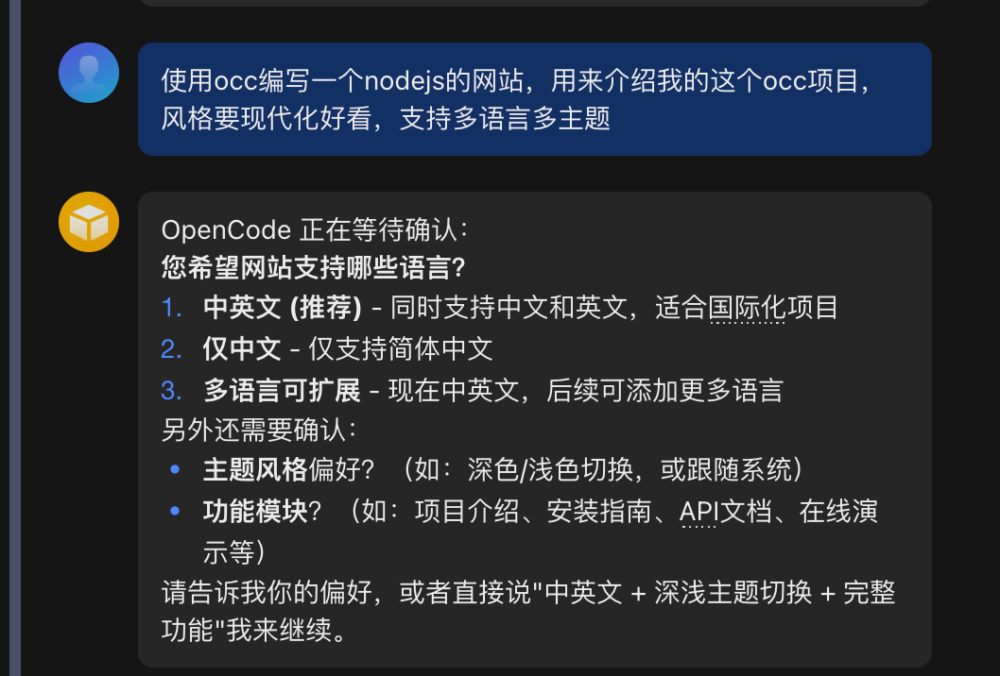
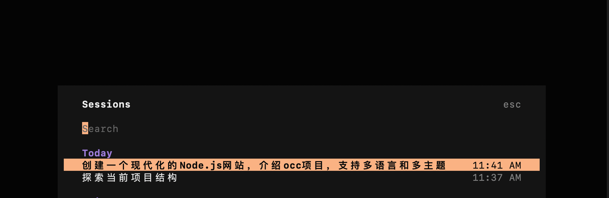

# 🌟 OpenCode Controller (OCC)

## 🌍 Language Switcher / 语言切换

**English** | [中文](docs/zh/README.md)

---

## 📦 Install

```bash
npx skills add gongxh13/opencode-controller
```

---

## 🚀 Why OCC?

OpenClaw has some limitations when executing complex programming tasks:

| Limitation | Impact |
|------------|--------|
| 🔥 High token consumption | Complex code analysis requires large context, cost significantly increases |
| 🐛 Difficult skill debugging | Testing custom skills requires repetitive conversation testing |
| 📊 Insufficient process visualization | Task progress lacks intuitive visualization |
| ⚡ Parallel execution difficulty | OpenCode binds to fixed working directory at startup |
| 📱 Not suitable for mobile | Requires terminal interaction, not mobile-friendly |

**OCC (OpenCode Controller)** addresses these issues by communicating with OpenCode Server via HTTP API, supporting full session management, task execution, and question handling without requiring PTY.

---

## ✨ Advantages

| # | Advantage | Description |
|---|-----------|-------------|
| 1 | 💰 **Low Cost** | OpenCode executes locally, OpenClaw only forwards messages - token consumption significantly reduced |
| 2 | 🤖 **Automation** | HTTP API communication, no manual continuous interaction required |
| 3 | 🔄 **Parallel Capability** | Support concurrent task processing through session pool management |
| 4 | 🛠️ **Extensibility** | Modular design, easy to extend, supports integration with ADT for complex workflows |

---

## 📖 Usage Example

### OpenClaw Integration

In OpenClaw, use the `occ` skill with the `/occ` prefix:

```bash
# Query existing sessions
/occ query

# Create a new session
/occ create "Create a React login page"

# Continue a session with additional task
/occ continue <session-id> "Add password reset feature"
```

### Real-world Demo

**1. Send task from OpenClaw:**



**2. OpenCode receives and executes:**

